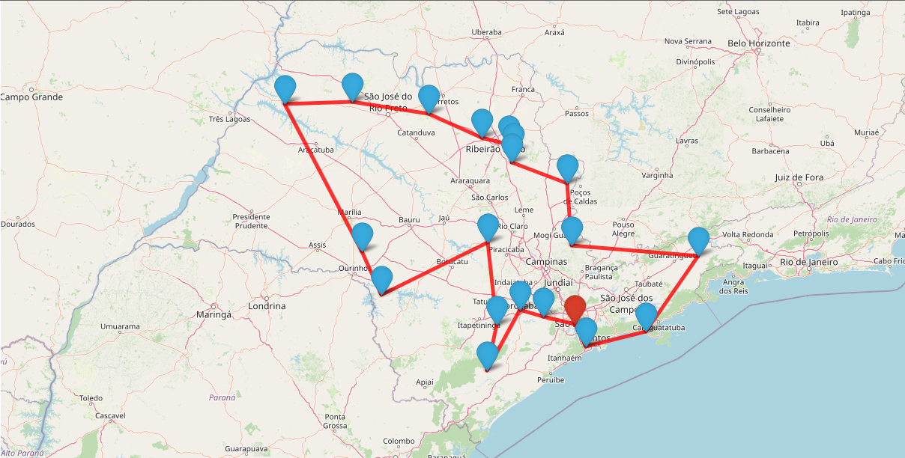

# Descobrindo o caminho perfeito: a otimização da rota entre cidades paulistas

Algoritmo de busca da menor rota entre 20 municípios paulistas

> Esse projeto foi desenvolvido para a disciplina de Otimização e Simulação e entregue dia 24/06/2022 durante a minha graduação em Ciência de Dados e Inteligência Artificial na PUC-SP

## 1. Contextualização

O Problema do Caixeiro Viajante é um problema que tenta determinar a menor rota para percorrer uma série de cidades (visitando uma única vez cada uma delas), retornando à cidade de origem. Ele é um problema de otimização NP-difícil inspirado na necessidade dos vendedores em realizar entregas em diversos locais (as cidades) percorrendo o menor caminho possível, reduzindo o tempo necessário para a viagem e os possíveis custos com transporte e combustível. [(1)](#referências)

## 2. Descrição dos Dados

O dataset [cidades_sp.tsv](./cidades_sp.tsv) foi gerado por mim com base no caderno [Mapas2.ipynb](./material-de-apoio/Mapas2.ipynb) disponibilizado pelo professor como material de apoio. Ele apresenta a distância entre municípios do estado de São Paulo para cada um dos municípios

> ⚠ Importante: O ponto que representa cada município foi definido como o centro geográfico de cada município

Amostra do dataset:

| origem | destino | distancia |
| :-- | :-- | :-- |
| Adamantina | Adamantina | 0.000000 |
| Adamantina | Adolfo | 148.940883 |
| Adamantina | Aguaí | 418.569402 |
| Adamantina | Águas da Prata | 453.052818 |
| Adamantina | Águas de Lindóia | 470.358245 |

## 3. Requisitos do Projeto

Encontre a melhor rota, começando pela capital e retornando até ela no final (problema do caixeiro viajante), sem repetição de cidades, entre pelo menos 20 cidades do estado de São Paulo.

Em caso de menos cidades que o total, crie uma forma de especificar quais cidades serão usadas para o cálculo.

- Uso o algoritmo de sua preferência.
- Crie um mapa para ilustrar a solução obtida

## 4. Proposta de solução

Cidades escolhidas para o desafio: `Sarapuí`, `Sarutaiá`, `Sebastianópolis do Sul`, `Serra Azul`,`Serra Negra`, `Serrana`, `Sertãozinho`, `Sete Barras`, `Severínia`,`Silveiras`, `Sorocaba`, `Sud Mennucci`, `São Paulo`, `São Pedro`,`São Pedro do Turvo`, `São Roque`, `São Sebastião`,`São Sebastião da Grama`, `São Simão`, `São Vicente`

- Solver: pywrapcp.RoutingModel [(2)](#referências)
- Frameworks usados: [OR-Tools](https://developers.google.com/optimization), [pandas](https://pandas.pydata.org/docs/), [numpy](https://numpy.org/doc/), [geopandas](https://geopandas.org/en/stable/docs.html), [networkx](https://networkx.org/), [folium](https://python-visualization.github.io/folium/), [matplotlib](https://matplotlib.org/stable/index.html)

## 6. Resultados:

A menor rota que sai da capital paulista e passa por todas as cidades selecionadas tem 1892 km de extenção

Rota: `São Paulo` → `São Vicente` → `São Sebastião` → `Silveiras` → `Serra Negra` → `São Sebastião da Grama` → `São Simão` → `Serra Azul` → `Serrana` → `Sertãozinho` → `Severínia` → `Sebastianópolis do Sul` → `Sud Mennucci` → `São Pedro do Turvo` → `Sarutaiá` → `São Pedro` → `Sarapuí` → `Sete Barras` → `Sorocaba` → `São Roque` → `São Paulo`

  

  

## 7. Oportunidades futuras

Uma vez que desenvolvi um método para calcular as distâncias entre uma amostra das cidades do estado, uma oportunidade futura é calcular cenários sem restrições de quantidade de cidades, por exemplo:

- qual é a rota mais curta que passa por TODAS as cidades do estado de São Paulo?
- qual é a rota mais longa que passa por TODAS as cidades do estado de São Paulo?
- qual é a rota mais curta que passa por TODAS as cidades do Brasil?
- qual é a rota mais longa que passa por TODAS as cidades do Brasil?

Contudo, tais implementações irão precisar de um poder computacional muito maior para resolver o problema na mesma escala de tempo que a solução desse projeto. Para uma solução em força-bruta, a escala de complexidade desse problema é $O(n!)$

## Referências

[(1)](#1-contextualização) Problema do caixeiro-viajante. In: WIKIPÉDIA: a enciclopédia livre. Disponível em: https://pt.wikipedia.org/wiki/Problema_do_caixeiro-viajante. Acesso em: 24 fev. 2023.

[(2)](#4-proposta-de-solução) Traveling Salesperson Problem. In: OR-Tools: fast and portable software for combinatorial optimization. Disponível em: https://developers.google.com/optimization/routing/tsp. Acesso em: 24 fev. 2023.
